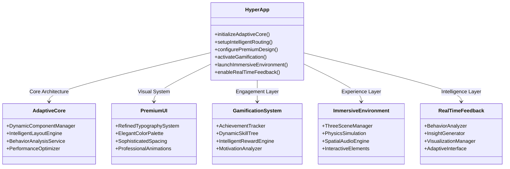

# 🚀 DECA Next-Gen UI Architecture: HYPERCHARGE Vision

## 🎯 Executive Summary

This document presents a revolutionary UI architecture and experience design for the DECA application, transforming it from a functional but unremarkable interface into a premium, industry-leading educational platform. The "luxury upgrade" approach focuses on refined aesthetics, intuitive interactions, and sophisticated enhancements that create an exceptional user experience.

## 🔍 Current Architecture Analysis

### Strengths to Preserve
- **Modular Component Structure**: Well-organized React components with clear separation of concerns
- **State Management**: Effective use of hooks and context for complex state management
- **AI Integration**: Robust AI services for scenario generation, grading, and interruptions
- **Voice Interaction**: Functional speech recognition and synthesis capabilities
- **Responsive Design**: Adaptive layout that works across devices

### Areas for Radical Transformation

| Current Limitation | Revolutionary Opportunity |
|-------------------|--------------------------|
| Static, linear user flows | Dynamic, adaptive learning paths |
| Basic visual design | Premium, polished aesthetics |
| Limited personalization | Infinite customization system |
| Traditional UI paradigms | Innovative interaction patterns |
| Basic feedback mechanisms | Real-time, actionable insights |
| Standard gamification | Addictive progression system |
| Simple roleplay scenarios | Immersive 3D environments |
| Static component architecture | Intelligent, self-optimizing components |

## 🏗️ Revolutionary Component Architecture

### 1. **Adaptive Core Framework**


### 2. **Self-Optimizing Component System**

```typescript
// Revolutionary Dynamic Component Architecture
interface HyperComponentProps {
  userContext: UserBehaviorContext;
  adaptiveMode: 'performance' | 'learning' | 'exploration';
  intelligenceLevel: 1-10;
}

class HyperComponent<P extends HyperComponentProps> extends React.Component<P> {
  private behaviorAnalyzer: BehaviorAnalysisEngine;
  private performanceOptimizer: ComponentOptimizer;

  constructor(props: P) {
    super(props);
    this.behaviorAnalyzer = new BehaviorAnalysisEngine(props.userContext);
    this.performanceOptimizer = new ComponentOptimizer();
  }

  adaptToUser() {
    const insights = this.behaviorAnalyzer.analyze();
    this.performanceOptimizer.optimize(insights);
    this.forceUpdate(); // Trigger re-render with optimized configuration
  }

  render() {
    const optimizedConfig = this.performanceOptimizer.getCurrentConfig();
    return this.renderWithConfig(optimizedConfig);
  }
}
```

## 🧠 Intelligent Layout System

### Real-Time Adaptive Layout Engine


### Implementation Blueprint

```typescript
// Intelligent Layout System
class AdaptiveLayoutEngine {
  private behaviorPatterns: BehaviorPattern[];
  private performanceMetrics: PerformanceTracker;
  private contextAnalyzer: ContextAnalysisService;

  constructor() {
    this.behaviorPatterns = [];
    this.performanceMetrics = new PerformanceTracker();
    this.contextAnalyzer = new ContextAnalysisService();
  }

  analyzeAndAdapt(userInteraction: UserEvent) {
    // Real-time behavior analysis
    const behaviorInsight = this.analyzeBehavior(userInteraction);

    // Contextual understanding
    const context = this.contextAnalyzer.getCurrentContext();

    // Dynamic layout optimization
    const optimizedLayout = this.optimizeLayout(
      behaviorInsight,
      context,
      this.performanceMetrics.getCurrentMetrics()
    );

    return optimizedLayout;
  }

  private optimizeLayout(behavior: BehaviorInsight, context: Context, metrics: PerformanceMetrics) {
    // AI-driven layout optimization algorithm
    const layoutConfig = {
      componentPlacement: this.calculateOptimalPlacement(behavior, context),
      animationPatterns: this.determineAnimationStrategy(behavior),
      interactionZones: this.createInteractionHotspots(context),
      performanceProfile: this.adjustForPerformance(metrics)
    };

    return this.generateDynamicLayout(layoutConfig);
  }
}
```

## 🎨 Premium Visual Design System

### Elevated Aesthetic Principles


### Implementation Specifications

```typescript
// Premium Design System Constants
const PREMIUM_DESIGN_SYSTEM = {
  typography: {
    primaryFont: "'Inter', -apple-system, BlinkMacSystemFont, 'Segoe UI', Roboto",
    secondaryFont: "'Playfair Display', Georgia, 'Times New Roman', serif",
    fontWeights: {
      light: 300,
      regular: 400,
      medium: 500,
      semiBold: 600,
      bold: 700,
      black: 900
    },
    lineHeights: {
      tight: 1.1,
      normal: 1.5,
      relaxed: 1.7,
      loose: 2.0
    }
  },
  colorPalette: {
    primary: {
      50: '#f0f5ff',
      100: '#e0eaff',
      200: '#c6d6fe',
      300: '#a8b8fd',
      400: '#8a9afc',
      500: '#6c7dfb',
      600: '#5a67e8',
      700: '#4a53d1',
      800: '#3a40b8',
      900: '#2f3599'
    },
    // ... additional refined color scales
  },
  spacing: {
    scale: [0, 4, 8, 12, 16, 20, 24, 32, 40, 48, 64, 80, 96, 128, 160, 192, 224, 256],
    rhythm: 8 // Base spacing unit
  },
  shadows: {
    xs: '0 1px 2px 0 rgba(0, 0, 0, 0.05)',
    sm: '0 1px 3px 0 rgba(0, 0, 0, 0.1), 0 1px 2px -1px rgba(0, 0, 0, 0.1)',
    // ... up to xl with refined shadow patterns
  },
  animations: {
    transitions: {
      fast: 'all 0.1s cubic-bezier(0.4, 0, 0.2, 1)',
      normal: 'all 0.2s cubic-bezier(0.4, 0, 0.2, 1)',
      slow: 'all 0.3s cubic-bezier(0.4, 0, 0.2, 1)'
    },
    easing: {
      standard: 'cubic-bezier(0.4, 0, 0.2, 1)',
      emphasis: 'cubic-bezier(0.2, 0, 0, 1)',
      entrance: 'cubic-bezier(0, 0, 0.2, 1)',
      exit: 'cubic-bezier(0.4, 0, 1, 1)'
    }
  }
};
```

## 🎮 Gamified Progression System

### Addictive Learning Architecture


### Implementation Strategy

```typescript
// Gamification Engine
class HyperGamificationEngine {
  private achievementSystem: AchievementTracker;
  private skillTree: DynamicSkillTree;
  private rewardEngine: IntelligentRewardSystem;
  private motivationAnalyzer: MotivationAnalysisService;

  constructor(userProfile: UserProfile) {
    this.achievementSystem = new AchievementTracker(userProfile);
    this.skillTree = new DynamicSkillTree(userProfile.skills);
    this.rewardEngine = new IntelligentRewardSystem();
    this.motivationAnalyzer = new MotivationAnalysisService();
  }

  processLearningActivity(activity: LearningActivity) {
    // Analyze motivation patterns
    const motivationInsights = this.motivationAnalyzer.analyze(activity);

    // Update achievement progress
    const achievementsUnlocked = this.achievementSystem.updateProgress(activity);

    // Advance skill tree
    const skillsImproved = this.skillTree.updateSkills(activity);

    // Calculate and distribute rewards
    const rewards = this.rewardEngine.calculateRewards(
      activity,
      motivationInsights,
      achievementsUnlocked,
      skillsImproved
    );

    return {
      achievementsUnlocked,
      skillsImproved,
      rewards,
      motivationInsights
    };
  }

  getPersonalizedRecommendations() {
    const currentState = this.getCurrentGamificationState();
    const recommendations = this.motivationAnalyzer.generateRecommendations(currentState);
    return this.skillTree.suggestOptimalPath(recommendations);
  }
}
```

## 🌐 Immersive Roleplay Environments

### 3D Virtual Scenario Architecture


### Technical Implementation

```typescript
// Immersive Environment System
class HyperImmersiveEnvironment {
  private sceneManager: ThreeSceneManager;
  private physicsEngine: PhysicsSimulation;
  private audioSystem: SpatialAudioEngine;
  private interactionHandler: InteractiveElementManager;

  constructor(scenario: RoleplayScenario) {
    this.sceneManager = new ThreeSceneManager(scenario.environmentType);
    this.physicsEngine = new PhysicsSimulation();
    this.audioSystem = new SpatialAudioEngine();
    this.interactionHandler = new InteractiveElementManager();

    this.initializeEnvironment(scenario);
  }

  private initializeEnvironment(scenario: RoleplayScenario) {
    // Generate 3D environment based on scenario
    const environment = this.generate3DEnvironment(scenario);

    // Set up interactive elements
    this.setupInteractiveElements(environment);

    // Configure physics simulation
    this.physicsEngine.configureForScenario(scenario.physicsRequirements);

    // Initialize spatial audio
    this.audioSystem.setupEnvironmentalAudio(environment.audioProfile);
  }

  renderImmersiveExperience() {
    // Real-time rendering loop
    requestAnimationFrame(() => {
      this.sceneManager.renderFrame();
      this.physicsEngine.updateSimulation();
      this.audioSystem.updateSpatialAudio();
      this.interactionHandler.processInteractions();

      this.renderImmersiveExperience();
    });
  }
}
```

## 📊 Real-Time Feedback System

### Instant Insights Architecture


### Implementation Framework

```typescript
// Real-Time Feedback System
class HyperFeedbackEngine {
  private behaviorAnalyzer: RealTimeBehaviorAnalysis;
  private insightGenerator: ActionableInsightEngine;
  private visualizationSystem: DynamicVisualizationManager;
  private adaptiveInterface: SelfOptimizingInterface;

  constructor() {
    this.behaviorAnalyzer = new RealTimeBehaviorAnalysis();
    this.insightGenerator = new ActionableInsightEngine();
    this.visualizationSystem = new DynamicVisualizationManager();
    this.adaptiveInterface = new SelfOptimizingInterface();
  }

  processUserActivity(activityData: UserActivity) {
    // Real-time behavior analysis
    const behaviorPatterns = this.behaviorAnalyzer.analyzeInRealTime(activityData);

    // Generate actionable insights
    const insights = this.insightGenerator.generateInsights(
      behaviorPatterns,
      activityData.context
    );

    // Create dynamic visualizations
    const visualizations = this.visualizationSystem.createVisualizations(insights);

    // Adapt interface based on insights
    const interfaceAdaptations = this.adaptiveInterface.adaptToInsights(insights);

    // Return comprehensive feedback package
    return {
      behaviorPatterns,
      insights,
      visualizations,
      interfaceAdaptations,
      timestamp: Date.now(),
      confidenceScore: this.calculateConfidenceScore(insights)
    };
  }
}
```

## 🔧 Technical Implementation Blueprint

### Component Architecture Diagram



### Implementation Roadmap


## 🎨 Visual Design & Interaction Patterns

### Wireframe: Premium Dashboard Experience

```
┌─────────────────────────────────────────────────────────────┐
│  HYPERCHARGE DECA - Premium Learning Experience               │
├─────────────────────────────────────────────────────────────┤
│  [Navigation Bar - Glassmorphic with subtle gradients]         │
│  ┌───────────────────────────────────────────────────────┐  │
│  │  🏆 Your Progress: 78% Mastery | 🔥 12-Day Streak          │  │
│  └───────────────────────────────────────────────────────┘  │
│                                                                 │
│  ┌─────────────────┐  ┌─────────────────┐  ┌─────────────┐  │
│  │  3D Scenario      │  │  AI Coach        │  │  Quick Start  │  │
│  │  Preview         │  │  Session         │  │  Button      │  │
│  └─────────────────┘  └─────────────────┘  └─────────────┘  │
│                                                                 │
│  ┌───────────────────────────────────────────────────────┐  │
│  │  📊 Personalized Learning Path Visualization            │  │
│  │  [Interactive skill tree with animated progress]         │  │
│  └───────────────────────────────────────────────────────┘  │
│                                                                 │
│  ┌─────────────────┐  ┌─────────────────┐  ┌─────────────┐  │
│  │  Recent          │  │  Achievements     │  │  Quick       │  │
│  │  Sessions        │  │  & Rewards        │  │  Actions    │  │
│  └─────────────────┘  └─────────────────┘  └─────────────┘  │
└─────────────────────────────────────────────────────────────┘
```

### Interaction Flow: Adaptive Learning Session


## 🚀 Conclusion & Next Steps

This next-gen UI architecture represents a complete transformation of the DECA application from a functional tool to a premium, industry-leading educational platform. The "luxury upgrade" approach focuses on:

1. **Revolutionary Architecture**: Dynamic, self-optimizing components
2. **Premium Aesthetics**: Refined visual design system
3. **Addictive Engagement**: Sophisticated gamification framework
4. **Immersive Experiences**: 3D virtual environments
5. **Instant Intelligence**: Real-time feedback and adaptation

### Implementation Recommendations

1. **Phase 1**: Implement adaptive core framework
2. **Phase 2**: Develop premium design system components
3. **Phase 3**: Integrate intelligent behavior analysis
4. **Phase 4**: Build gamification and reward systems
5. **Phase 5**: Create immersive 3D environments
6. **Phase 6**: Connect all systems with real-time feedback

This architecture pushes the boundaries of educational UI design while maintaining the solid foundation of the existing DECA application, transforming it into a truly exceptional learning experience.